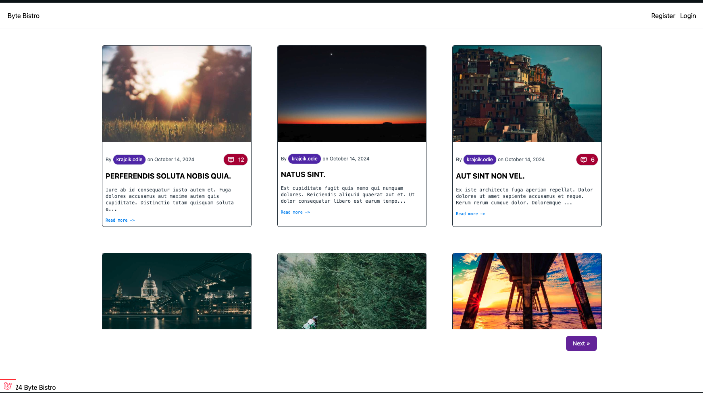
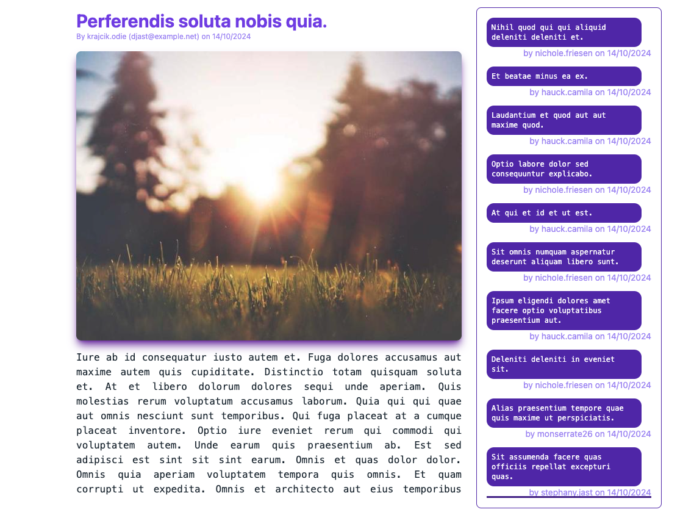
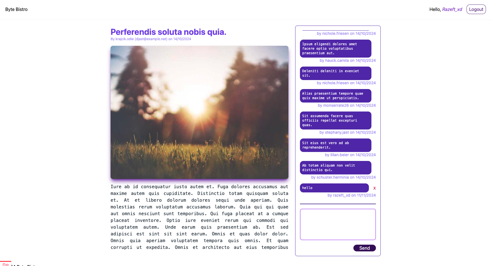
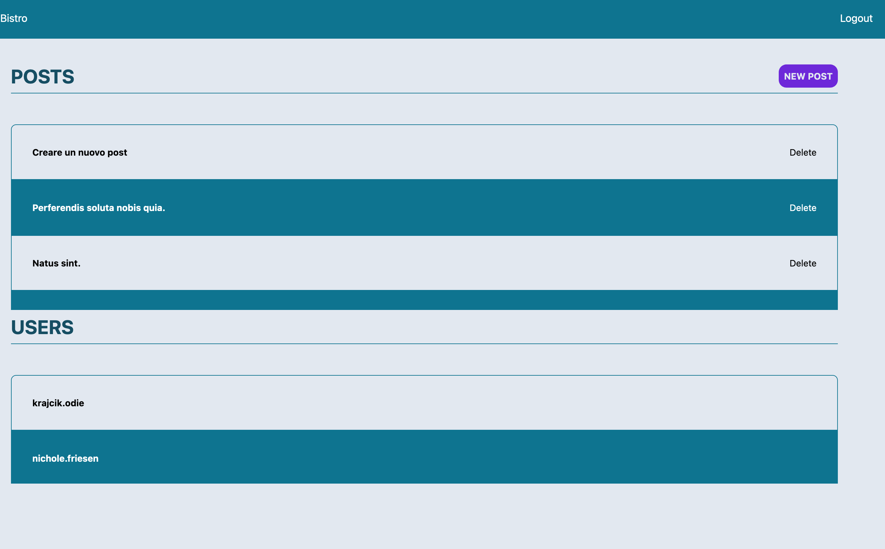

# Laravel Blog Project with Inertia.js and Vue.js

Welcome to the **Laravel Blog Project**, a blog application built using **Laravel**, **Inertia.js**, and **Vue.js**. This project features role-based access for managing posts and comments.

## Features

-   **Homepage**: Displays a list of recent blog posts.
-   **Blog Page**: Accessible to all users where they can read posts and leave comments.
-   **User Dashboard**: Available only to admins for managing posts and users.
-   **Role-based Permissions**:
    -   **Admin**: Can create and manage all posts and users.
    -   **Moderator**: Can delete comments from any user.
    -   **User**: Can only delete their own comments.

## Screenshots

Here are some screenshots of the project:

### 1. Home Page



The main landing page displaying blog posts.

### 2. Blog Page



A standard blog post page showing the content and comments. Users can view and interact with comments.

### 3. Blog User Login



Shows how logged-in users can delete their own comments on blog posts.

### 4. Admin Dashboard



The dashboard where admins can manage posts, users, and roles.

## Installation

1. **Clone the repository**:

    ```bash
    git clone https://github.com/yourusername/laravel-blog.git
    cd laravel-blog
    ```

2. **Install PHP dependencies**:

    ```bash
    composer install
    ```

3. **Install JavaScript dependencies**:

    ```bash
    npm install
    npm run dev
    ```

4. **Set up environment variables**:
   Copy the `.env.example` file to `.env` and configure your database settings:

    ```bash
    cp .env.example .env
    php artisan key:generate
    ```

5. **Run migrations**:

    ```bash
    php artisan migrate
    ```

6. **Seed the database** (optional):

    ```bash
    php artisan db:seed
    ```

7. **Run the development server**:

    ```bash
    php artisan serve
    ```

    Your application will be available at `http://127.0.0.1:8000`.

## Usage

-   **Users** can browse posts and leave comments. They can only delete their own comments.
-   **Admins** have access to the dashboard to manage posts and user roles.
-   **Moderators** can delete any user's comments.

## Project Structure

-   **app/Http/Controllers**: Handles requests and returns views via Inertia.
-   **app/Models**: Defines the `Post`, `Comment`, and `User` models.
-   **resources/views**: Contains Blade views, primarily for rendering Inertia.js.
-   **resources/js/Pages**: Contains Vue.js components for each page (e.g., `HomePage.vue`, `BlogPage.vue`, `Dashboard.vue`).
-   **public/screenshots**: Contains images to illustrate the app.

## License

This project is open-source and available under the [MIT License](LICENSE).
